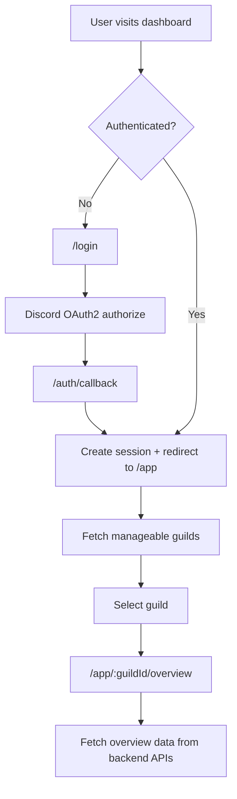

## 1. Product Overview
United Bunnies Dashboard is a production-ready web dashboard for managing and viewing Discord server data for the existing United Bunnies bot.
It is a separate project from the bot and will connect to the bot later without rebuilding or replacing the bot.

- Primary purpose: provide authenticated, server-scoped dashboard access for Discord guild owners/admins
- Users: Discord users who manage servers where United Bunnies is present (or will be present)
- Value: a premium UI foundation + secure backend/API foundation that can scale into future features

## 2. Core Features

### 2.1 User Roles
| Role | Registration Method | Core Permissions |
|------|---------------------|------------------|
| Discord User | Discord OAuth2 | Sign in, select guilds they can manage, view dashboard home |

### 2.2 Feature Module
1. **Authentication**: Discord OAuth2 login, secure sessions, logout
2. **Protected App Shell**: responsive sidebar layout, route protection, loading/error states
3. **Guild Selector**: list/manageable guilds and navigate into a guild-scoped dashboard
4. **Dashboard Home (Overview)**: show real server/bot details when available; show empty state otherwise
5. **Backend API Foundation**: versioned REST API, structured errors, request validation, health checks
6. **MongoDB Foundation**: connection, session store, minimal collections for user identity caching and future settings

### 2.3 Page Details
| Page Name | Module Name | Feature description |
|-----------|-------------|---------------------|
| /login | OAuth entry | Sign in with Discord, error states, redirect handling |
| /auth/callback | OAuth finalize | Exchanges code for tokens, establishes session, redirects to app |
| /app | App shell | Protected layout, sidebar, top bar, guild selector entry |
| /app/:guildId/overview | Overview | Shows server/bot stats only when sourced from real APIs |

## 3. Core Process

- User opens dashboard URL
- If not authenticated, user is routed to /login
- User clicks “Continue with Discord”
- Dashboard redirects to Discord OAuth2, then back to /auth/callback
- Backend exchanges code for tokens, stores session securely, and redirects to /app
- User sees guild selector (or selector within layout)
- User picks a guild and navigates to /app/:guildId/overview
- Frontend calls backend APIs for guild data and renders available fields; missing fields render as “Unavailable” state

## 4. User Interface Design

### 4.1 Design Style
- Theme: dark-first premium glassmorphism
- Accents: purple + blue (consistent tokens across components)
- Typography: modern, high-legibility; strong hierarchy; generous spacing
- Components: shadcn/ui primitives (Radix-based) styled with Tailwind
- Motion: Framer Motion for route transitions, sidebar interactions, and skeleton/empty-state polish

### 4.2 Page Design Overview
| Page Name | Module Name | UI Elements |
|-----------|-------------|-------------|
| /login | Auth card | Glass card, brand header, OAuth button, error banner |
| /app | Sidebar layout | Responsive sidebar (collapsible mobile drawer), top bar, guild selector |
| /app/:guildId/overview | Stats grid | Icon + name header, stat tiles, skeleton loading, error state, empty “Recent activity” section |

### 4.3 Responsiveness
- Desktop-first layout with a collapsible sidebar and a mobile drawer pattern
- Touch-friendly controls and accessible focus states
- Fixed-height app shell with internal scrolling for content panels

## 5. Data Display Rules (Overview Page)

The homepage displays only real data when available from trusted sources (Discord APIs, bot bridge later, or MongoDB caches populated by real events). No mock data is shown.

- Server icon: from Discord (guild icon) when available
- Server name: from Discord
- Member count: only if available (likely from bot token / future bridge); otherwise show unavailable state
- Channel count: only if available (bot token required); otherwise show unavailable state
- Role count: only if available (bot token required); otherwise show unavailable state
- Bot online/offline status: only if available (future bot bridge); otherwise show unavailable state
- Bot latency: only if available (future bot bridge); otherwise show unavailable state
- Server owner: only if available (bot token required or future bridge); otherwise show unavailable state
- Bot join date: only if available (bot token required or future bridge); otherwise show unavailable state
- Dashboard version: from backend (/api/v1/meta)
- Recent activity: rendered as empty until implemented

## 6. Non-Goals (This Phase)

Do NOT implement any of the following in this phase:
- Moderation pages
- Command settings
- Premium pages
- Developer dashboard
- Music
- Tickets
- Logging
- Leveling
- Welcome
- Reaction roles

## 7. Non-Functional Requirements

- Production-ready architecture: modular, scalable, and Render-friendly
- Security: session-based auth, httpOnly cookies, secure defaults, server-side token storage only
- Reliability: consistent error responses, user-safe UI error states, health endpoints
- Maintainability: clear module boundaries, shared types, consistent naming, linting/formatting
